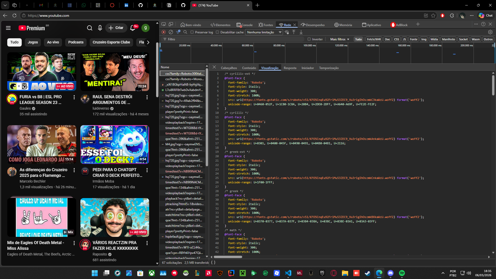
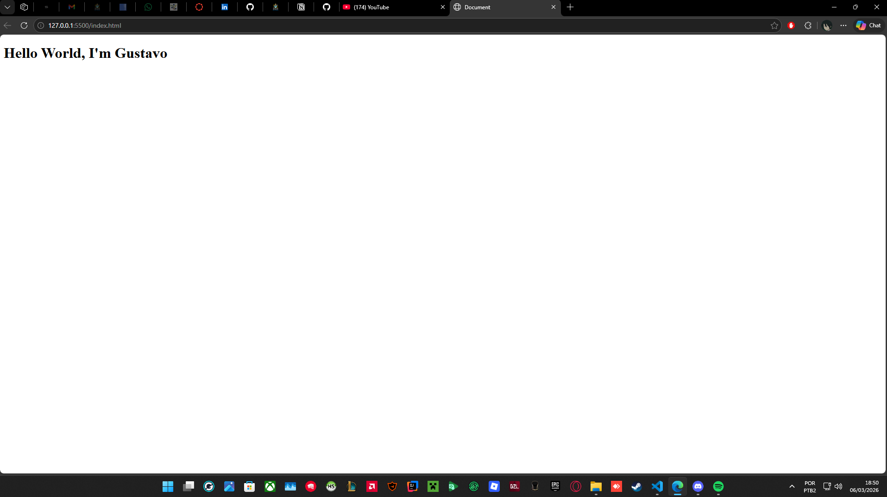
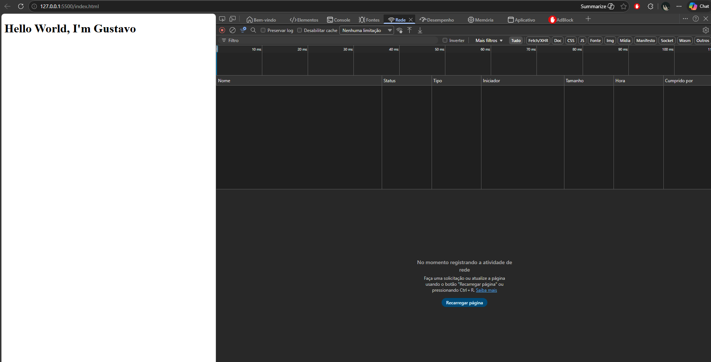

# Trabalho Prático - Semana-01

## Informações Gerais
Coloque aqui os seus dados
- Nome: Gustavo Fernandes Vieira
- Matricula: 1419487

## Tela de inspeção com navegador

## Tela do resultado do arquivo index.html

## Orientações sobre Linguagem MarkDown

Acesse e leia o [tutorial do GitHub com a sintaxe básica para escrita de texto em Markdown](https://docs.github.com/pt/get-started/writing-on-github/getting-started-with-writing-and-formatting-on-github/basic-writing-and-formatting-syntax).

Veja aqui o exemplo de como colocar uma imagem nos locais acima. 

